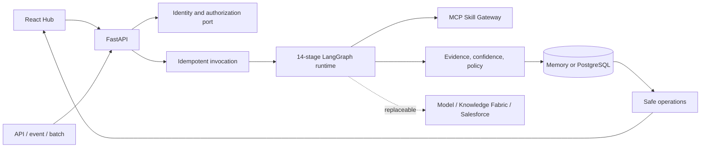

# Intelligence Agent architecture

```mermaid
flowchart LR
  UI[React Hub] --> API[FastAPI]
  EVT[API / event / batch] --> API
  API --> AUTH[Identity and authorization port]
  API --> INV[Idempotent invocation]
  INV --> GRAPH[14-stage LangGraph runtime]
  GRAPH --> MCP[MCP Skill Gateway]
  GRAPH --> GOV[Evidence, confidence, policy]
  GOV --> STORE[(Memory or PostgreSQL)]
  GRAPH -. replaceable .-> EXT[Model / Knowledge Fabric / Salesforce]
  STORE --> OPS[Safe operations]
  OPS --> UI
```

The control plane owns limits, evidence validation, confidence and policy. Skills and models cannot bypass it.
