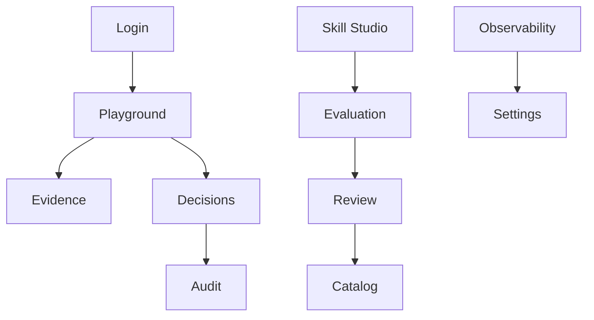

# UI flow

```mermaid
flowchart TD
  Login --> Playground --> Evidence
  Playground --> Decisions --> Audit
  Studio[Skill Studio] --> Evaluation --> Review --> Catalog
  Observability --> Settings
```

Synthetic data and POC authentication are visibly labelled. Authorization is enforced server-side.
